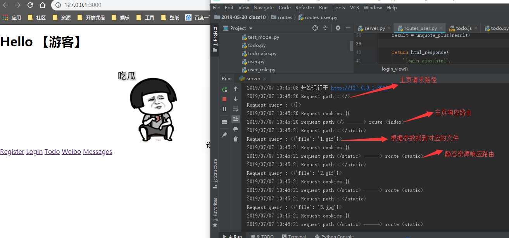
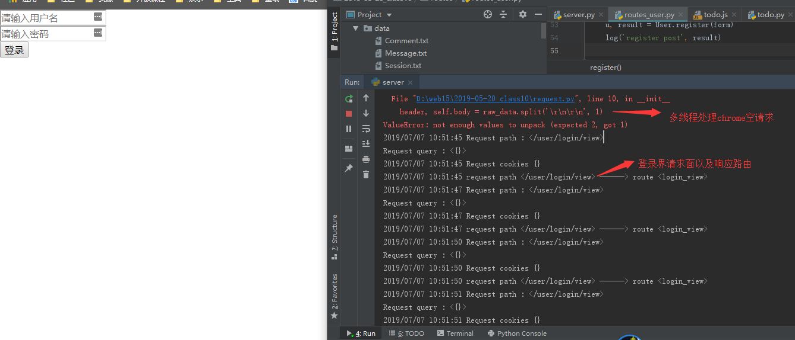
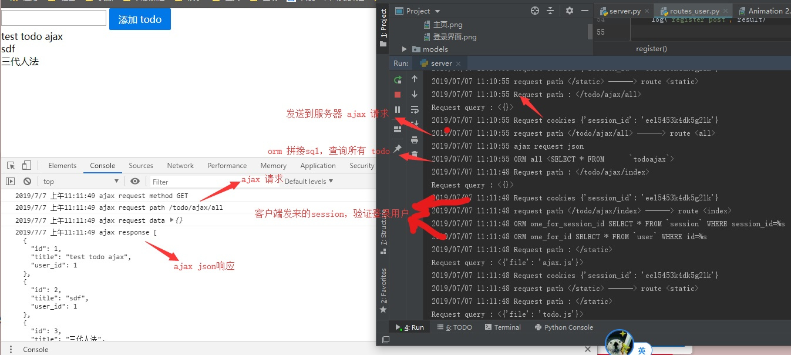
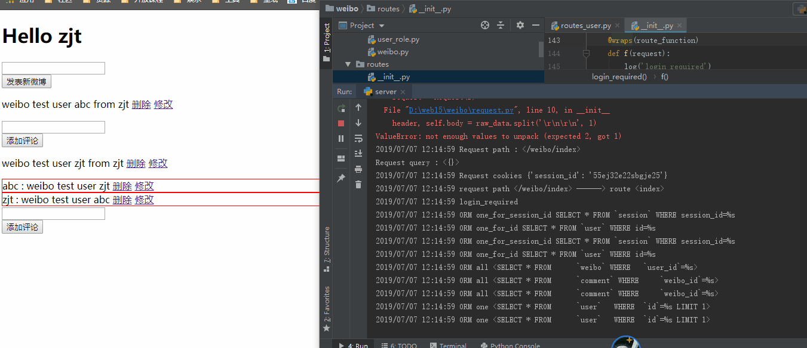
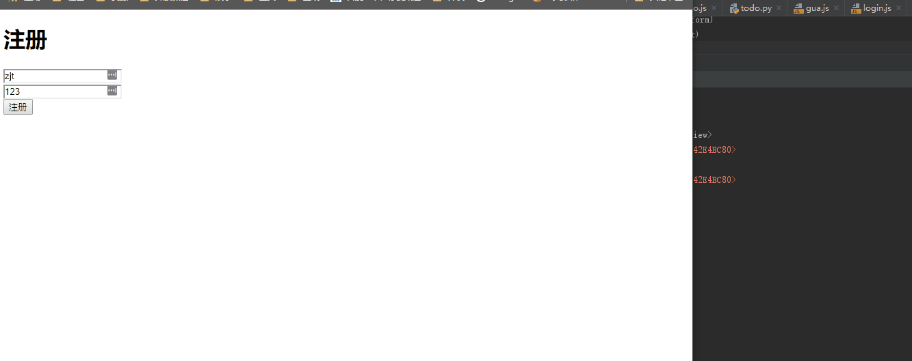
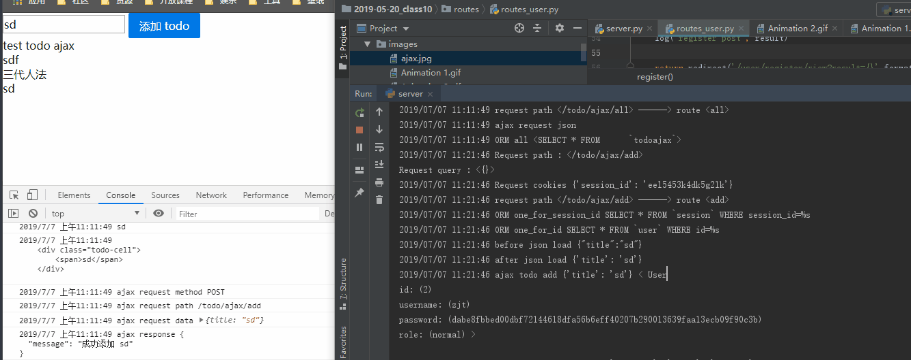

基于 Socket 的 HTTP 服务器和 Web 框架
=====================

## 简介

- 实现底层为 Python Sokcet 的 HTTP 服务器，而且内嵌一
个 MVC Web 框架。
- 服务器采用多线程监听请求，处理请求流程从解析 url 和
request 信息开始，然后 Web 框架根据解析得到的路径获
取对应的路由函数（保存的业务代码），路由计算
Model 中数据和暂存的 request ，之后将结果填入模板中
生成响应信息，最后服务器把响应发回给客户。

## 运行环境

Windows10

python 3.6

```
pip install pymysql jinja2
```
## 本地测试

```
python reset.py
python server.py
```

## 详细
### 主页


## 登录界面


## ajax todo 前端和后端发送请求接收响应


## weibo CRUD gif
微博增删改查，微博权限控制（博主可以修改博文和删除博文，博主可以删除评论但不可以修改评论。评论楼主可以修改和删除评论）


## 注册登录 gif


## ajax gif


